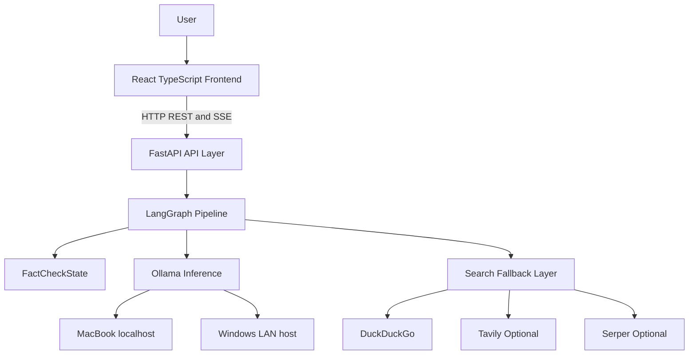
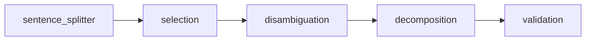

# System Overview

FactCheck AI is a single-user, locally deployed fact-checking application. It accepts natural-language claims through a web interface, processes them through a multi-agent pipeline, and returns evidence-grounded verdicts with confidence scores, explanations, and source URLs.

## Goals

- Evidence-grounded verdicts: every verdict must be based on retrieved web evidence.
- Conversational continuity: follow-up questions are grounded in evidence from the current session.
- Local operation: LLM inference runs through Ollama, either on the MacBook or a LAN-connected Windows PC.
- Confidence transparency: each claim result includes a normalized confidence score.
- Source traceability: final citations must originate from retrieved evidence URLs.

## Component Topology

## Agent Pipeline

The planned pipeline contains five specialized agents:

- Extractor Agent: decomposes raw text into atomic, verifiable claims.
- Verifier Agent: retrieves evidence and produces claim verdicts.
- Reporter Agent: consolidates claim results into a human-readable report.
- Dialogue Agent: answers follow-up questions from session evidence only.
- Orchestrator Agent: routes state through the graph and exposes progress.

Phase 2 implements the Extractor Agent. The Verifier, Reporter, Dialogue, persistence, SSE streaming, and frontend behavior remain future phases.

## Extractor Subgraph

The extractor is a sequential LangGraph subgraph adapted from ClaimeAI's Claimify-style approach:

Selection and disambiguation use voting for precision. Decomposition turns decontextualized sentences into atomic claims, and validation filters incomplete claim fragments before the main pipeline writes `extracted_claims`.

## Design Principles

- Schema-first development: `factcheck/state.py` is frozen at the end of Phase 1.
- Configuration over code: host URLs, model names, timeouts, and debug flags live in `.env`.
- Fail-visible errors: future pipeline failures must populate state error fields rather than failing silently.
- Privacy by architecture: user data remains local; cloud LLM APIs are not used.

