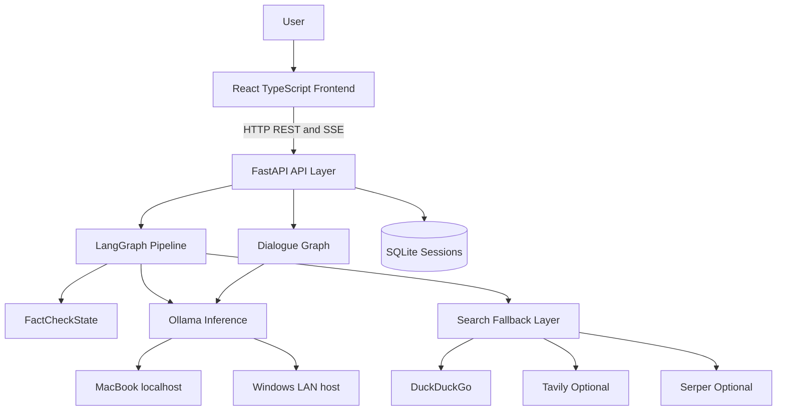
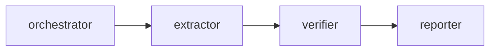
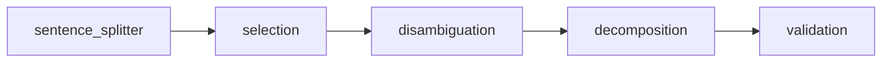

# System Overview

FactCheck AI is a single-user, locally deployed fact-checking application. It accepts natural-language claims through a web interface or API, processes them through a multi-agent pipeline, and returns evidence-grounded verdicts with confidence scores, explanations, and source URLs.

## Goals

- Evidence-grounded verdicts: every verdict must be based on retrieved web evidence.
- Conversational continuity: follow-up questions are grounded in evidence from the current session.
- Local operation: LLM inference runs through Ollama, either on the MacBook or a LAN-connected Windows PC.
- Confidence transparency: each claim result includes a normalized confidence score.
- Source traceability: final citations must originate from retrieved evidence URLs.

## Component Topology

The React frontend is planned. Today, clients interact with the FastAPI layer directly (curl, dev hack terminal, or a future frontend).

## Agent Pipeline

The system contains five specialized agents:

- **Orchestrator Agent**: marks the pipeline as running before agent execution begins.
- **Extractor Agent**: decomposes raw text into atomic, verifiable claims via a Claimify-style subgraph.
- **Verifier Agent**: retrieves web evidence and produces per-claim verdicts. All claims are verified in parallel; each completion emits a `verdict_ready` SSE event.
- **Reporter Agent**: consolidates claim results into a human-readable markdown report.
- **Dialogue Agent**: answers follow-up questions from session evidence only. Runs outside the main pipeline on demand when a follow-up message arrives.

Main pipeline flow:

The dialogue agent is a separate LangGraph invoked when a user posts a follow-up message to a completed session.

### Verifier Capabilities

- **Parallel verification**: all extracted claims are verified concurrently via `asyncio.gather`.
- **Hybrid evidence retrieval**: top-ranked search hits are fetched as full pages; remaining hits use snippets.
- **BM25 re-ranking**: Okapi BM25 scores evidence hits before the evaluator LLM is invoked.
- **Domain credibility tiers**: static high/medium/low tiers applied during re-ranking and exposed to the evaluator prompt.
- **Search fallback**: DuckDuckGo primary, with optional Tavily and Serper when API keys are configured.

## Extractor Subgraph

The extractor is a sequential LangGraph subgraph adapted from ClaimeAI's Claimify-style approach:

Selection and disambiguation use voting for precision. Decomposition turns decontextualized sentences into atomic claims, and validation filters incomplete claim fragments before the main pipeline writes `extracted_claims`.

## Design Principles

- Schema-first development: `factcheck/state.py` is the shared contract between agents; changes require review of all readers and writers.
- Configuration over code: host URLs, model names, timeouts, and debug flags live in `.env`.
- Fail-visible errors: pipeline failures populate state error fields and emit `pipeline_error` SSE events rather than failing silently.
- Privacy by architecture: user data remains local; cloud LLM APIs are not used.
